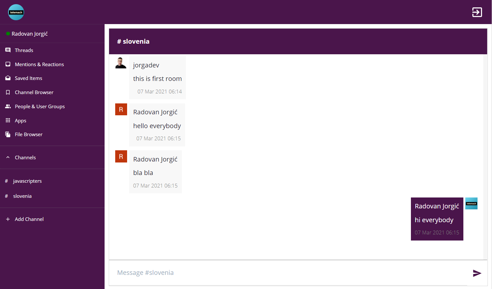

# Slack Clone

> Slack clone with chat functionality built in React

Simple slack clone with emphasis on chat functionality. Main point was to practice react skills and use Firebase database for fetching and saving data. App was also hosted on firebase hosting and includes Google OAuth.

_Live demo: [slack-clone-3cc59.web.app](https://slack-clone-3cc59.web.app/)_



## Installation

OS X & Linux & Windows:

```sh
npm install
```

## Release History

- 0.0.1
  - Simple chat functionality, includes Google authentication

## Contributing

1. Fork it (<https://github.com/jorgadev/slack-clone/fork>)
2. Create your feature branch (`git checkout -b feature/fooBar`)
3. Commit your changes (`git commit -am 'Add some fooBar'`)
4. Push to the branch (`git push origin feature/fooBar`)
5. Create a new Pull Request
